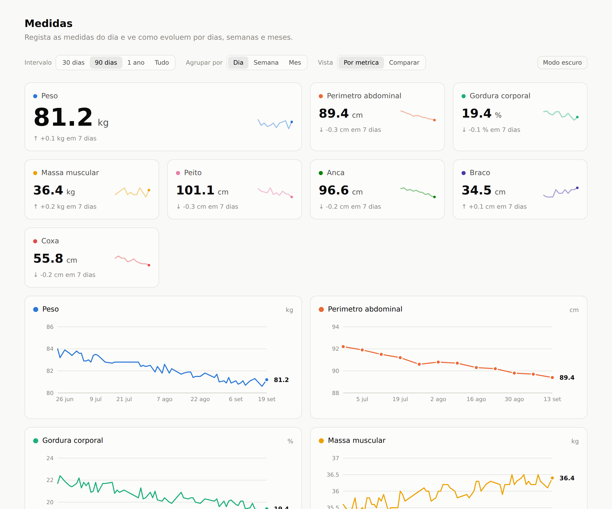
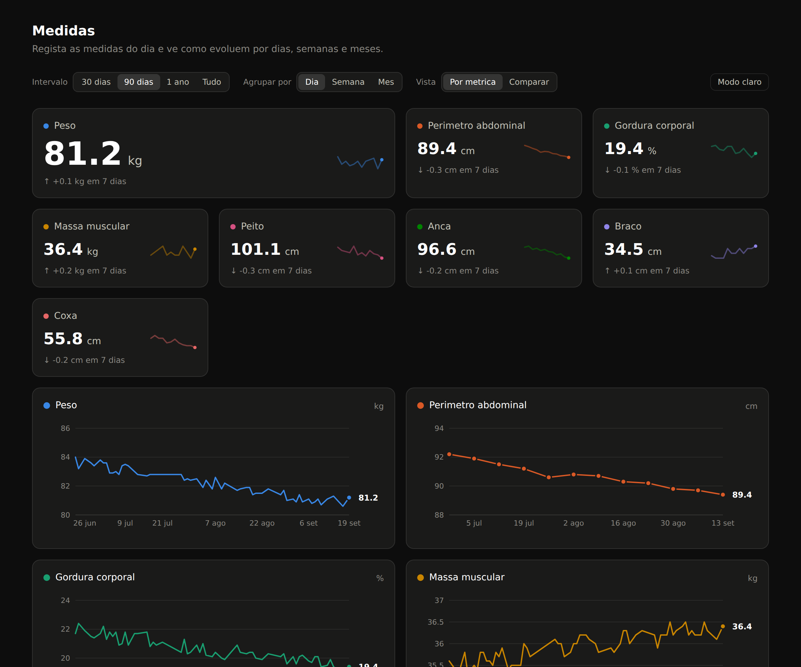

# Medidas

App para registar medidas antropométricas todos os dias — peso, perímetro
abdominal, gordura corporal, massa muscular e perímetros — e ver como evoluem
por dias, semanas e meses.

Next.js 16 + TypeScript, SQLite local, sem serviços externos.




## Arrancar

```bash
npm install
npm run dev          # http://localhost:3000
```

Não é preciso configurar nada: a base de dados é criada na primeira utilização
em `data/medidas.db`.

Para experimentar com dados: abre a app, carrega em **Importar JSON** e escolhe
`exemplo/medidas-exemplo.json` (240 dias de dados fictícios, gerados).

```bash
npm run build && npm start   # produção
npm run lint
```

## O que faz

- **Um registo por dia.** A data é a chave: voltar a gravar o mesmo dia corrige
  o registo em vez de criar um duplicado. Campos em branco ficam por medir
  (`null`), não a zero.
- **Cartões** com o valor mais recente de cada métrica, a variação face a ~7
  dias antes e uma mini-linha da fase final da série.
- **Um gráfico por métrica**, com intervalo (30 / 90 / 365 dias / tudo) e
  agrupamento por dia, semana ou mês (semana e mês são a média das medições
  existentes).
- **Vista comparativa**, com as métricas escolhidas indexadas em % face à
  primeira medição do intervalo.
- **Tabela** de todos os registos do intervalo, com apagar.
- **Exportar JSON/CSV e importar JSON**, para cópias de segurança e para levar
  os dados para outro lado.

## Onde estão os dados

Num ficheiro SQLite em `data/medidas.db` (configurável em `DATABASE_FILE`). A
pasta `data/` está no `.gitignore`: são dados pessoais e não entram no
repositório.

**Isto tem uma consequência para o deploy.** Em plataformas com sistema de
ficheiros efémero — Vercel, Netlify e afins — o ficheiro desaparece a cada
arranque. Para essas, ou se quiseres a app acessível de vários dispositivos, é
preciso uma base de dados alojada. O ponto de troca está isolado: `lib/repo.ts`
é a única fronteira de acesso a dados (seis funções), e só ele precisa de mudar.
Para uso local ou numa máquina com disco persistente (um VPS, um Raspberry Pi,
Docker com volume), o SQLite chega e sobra.

Enquanto o ficheiro for local, **a exportação é a cópia de segurança.**

## Estrutura

```
app/
  page.tsx           componente de servidor: lê os registos e entrega-os ao painel
  actions.ts         server actions de gravar e apagar
  api/export         descarregar tudo em JSON ou CSV
  api/import         restaurar uma exportação (numa transação)
  globals.css        tokens de cor, claro e escuro
lib/
  metrics.ts         definição das 8 métricas — único sítio a mexer para acrescentar uma
  db.ts              ligação SQLite, esquema e migração de colunas
  repo.ts            fronteira de acesso a dados
  validation.ts      esquemas zod, partilhados pelo formulário e pela importação
  series.ts          intervalos, agregação, variações, indexação relativa e escala Y
  dates.ts           dias de calendário em AAAA-MM-DD, sem fusos horários
components/          painel, filtros, formulário, gráficos, tabela
exemplo/             conjunto de dados de demonstração
```

## Acrescentar uma métrica

Uma entrada em `METRICS` (`lib/metrics.ts`) com um par de cores do próximo slot
livre da paleta. O formulário, os cartões, os gráficos, a tabela, a exportação e
a coluna na base de dados seguem daí — `lib/db.ts` acrescenta a coluna em falta
no arranque seguinte.

## Notas sobre os gráficos

Três decisões que não são de gosto e que convém não desfazer sem querer:

**Um gráfico por métrica, nunca dois eixos Y.** Peso em kg, perímetros em cm e
gordura em % não partilham escala. Sobrepô-los com dois eixos independentes
deixa esticar as escalas até qualquer cruzamento parecer significativo, e quem
lê não tem como saber que o cruzamento é um artefacto do eixo. Quando é mesmo
preciso ver as métricas juntas, a vista **Comparar** indexa tudo a uma base
comum e usa um único eixo honesto.

**A cor pertence à métrica, não à sua posição.** Cada métrica tem um slot fixo
da paleta, por isso ligar e desligar séries nunca repinta as que ficam. Os oito
pares claro/escuro passam os limiares de daltonismo em pares adjacentes nos dois
modos; a ordem dos slots é o mecanismo, não decoração. Trocar um hexadecimal
isolado desfá-lo.

**A variação não é verde nem vermelha.** A app não sabe qual é o objetivo de
quem a usa: descer 2 kg pode ser a meta ou o alarme. A direção está na seta e no
sinal; a cor não emite um juízo que a app não tem como fazer.

O modo escuro é escolhido, não invertido: são os mesmos oito tons, redefinidos
contra a superfície escura.
