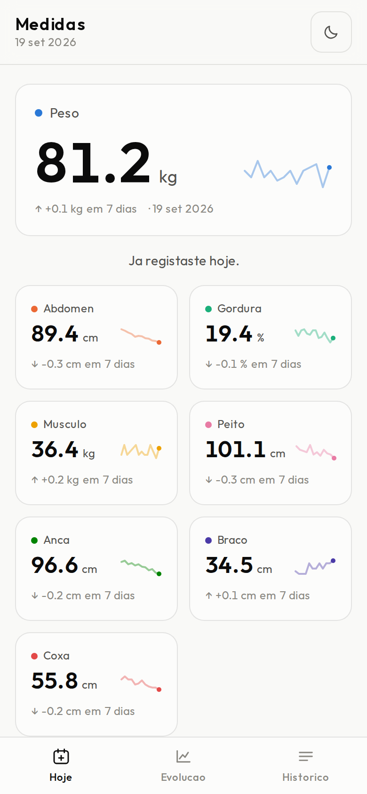
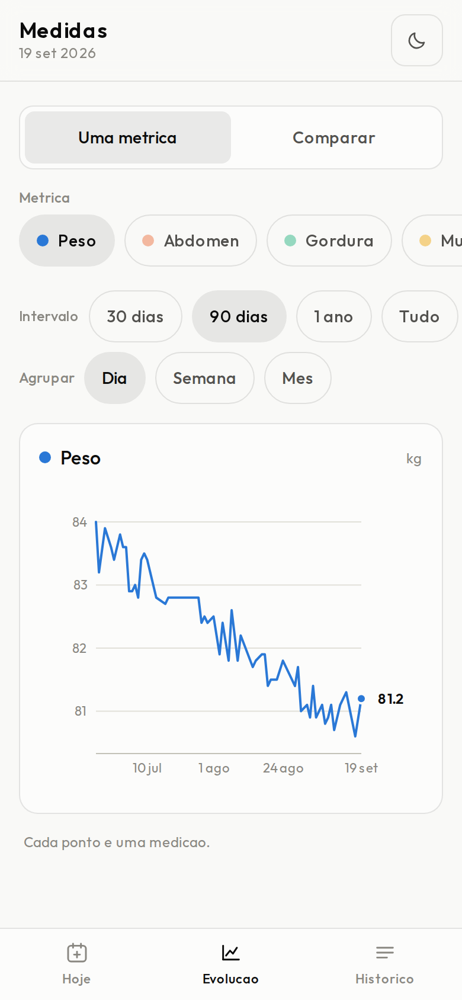
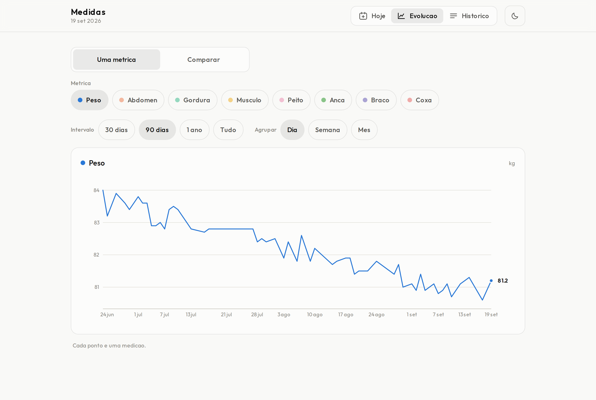

# Medidas

App para registar medidas antropométricas todos os dias — peso, perímetro
abdominal, gordura corporal, massa muscular e perímetros — e ver como evoluem
por dias, semanas e meses.

Next.js 16 + TypeScript, Postgres na Supabase. **Aplicação de acesso restrito:**
não há registo público — as contas são criadas pelo administrador. Desenhada
primeiro para o telemóvel, que é onde se regista uma pesagem, de manhã, com uma
mão.

<p>
  
  
  
</p>



## Arrancar

```bash
npm install
cp .env.example .env.local     # e preenche os dois valores
npm run dev                    # http://localhost:3000
```

Os dois valores estão no dashboard da Supabase, em **Project Settings → API**:
o URL do projeto e a chave publicável (`sb_publishable_...`). São públicos por
desenho — vão no browser. Quem protege os dados são as políticas da base de
dados, não o segredo da chave.

O esquema está em `supabase/migrations/`. Num projeto novo, cola esse SQL no
**SQL Editor** da Supabase (ou aplica-o com o CLI da Supabase).

### Fechar o registo e criar-te a ti

Esta app é restrita, e isso tem de ser imposto **também do lado da Supabase** —
não basta não haver botão de registo na interface. Em **Authentication → Sign In
/ Providers → Email**, desliga *Allow new users to sign up*. Sem isso, qualquer
pessoa cria conta chamando a API diretamente.

Depois cria a tua conta em **Authentication → Users → Add user** (com *Auto
confirm user*), e promove-te a administrador no **SQL Editor**:

```sql
insert into public.admins (user_id)
select id from auth.users where email = 'o-teu-email@exemplo.com';
```

Isto faz-se pelo SQL Editor de propósito: a tabela `admins` não tem política de
escrita nenhuma, por isso ninguém se promove a administrador através da
aplicação, aconteça o que acontecer no código.

A partir daí, as contas criam-se dentro da app, em **Histórico → Administração**.

### Preencher os documentos legais

Abre `lib/legal.ts` e preenche o nome, o email, a morada e o NIF do responsável
pelo tratamento. Esses valores aparecem nos Termos e na Política de Privacidade,
e o RGPD obriga a identificar quem trata os dados. Enquanto lá estiverem os
marcadores, eles aparecem no ecrã — de propósito.

Para experimentar com dados: entra, vai a **Histórico → Importar JSON** e
escolhe `exemplo/medidas-exemplo.json` (240 dias de dados fictícios, gerados).

```bash
npm run build && npm start   # produção
npm run lint
```

Uma nota para quem mexer no código: `app/actions.ts` é um módulo `"use server"`
e só pode exportar funções assíncronas — exportar uma constante de lá compila,
passa no lint e só rebenta quando alguém submete o formulário. É por isso que o
estado partilhado com o formulário vive em `lib/form-state.ts`.

## O que faz

Três separadores, um por pergunta:

**Hoje** — como estou, e já registei?
- O peso em grande, com a variação face a ~7 dias antes e uma mini-linha da
  fase recente; as outras sete métricas em cartões compactos.
- Formulário com os três campos do dia-a-dia sempre à vista e os perímetros
  atrás de um toque, para o gesto diário caber num ecrã sem deslizar.
- **Um registo por dia.** A data é a chave: voltar a gravar o mesmo dia corrige
  o registo em vez de criar um duplicado, e o formulário mostra o que já lá
  está. Campos em branco ficam por medir (`null`), não a zero.

**Evolução** — o que mudou, e em que ritmo?
- Um gráfico de cada vez, com a métrica escolhida numa fila de fichas.
- Intervalo (30 / 90 / 365 dias / tudo) e agrupamento por dia, semana ou mês
  (semana e mês são a média das medições existentes).
- Vista **Comparar**, com as métricas escolhidas indexadas em % face à primeira
  medição do intervalo.

**Histórico** — o que é que eu registei no dia 12?
- Uma ficha por dia no telemóvel, tabela no ecrã grande, com apagar.
- Exportar JSON/CSV e importar JSON, para cópias de segurança e para levar os
  dados para outro lado.
- A conta: email, mudar a palavra-passe, terminar sessão e, para o
  administrador, a ligação à administração.

## Contas, consentimento e onboarding

**Não há registo público.** O administrador cria a conta com uma palavra-passe
temporária que aparece **uma só vez** no ecrã — não fica guardada legível em
lado nenhum, nem na base de dados nem em registos. Quem a receber é obrigado a
mudá-la na primeira entrada, antes de chegar a qualquer outra parte da app.

**Não há recuperação automática de palavra-passe.** Quem se esquecer pede ao
administrador, que repõe uma nova temporária. A página de entrada diz isso em
vez de deixar a pessoa às voltas.

**Onboarding em três passos**, na primeira entrada:

1. **Termos.** Duas caixas separadas e nenhuma pré-marcada: uma para os Termos e
   a Política de Privacidade, outra — expressa — para o tratamento de dados de
   saúde. São duas porque o Artigo 9.º do RGPD trata dados de saúde como
   categoria especial e exige consentimento explícito, distinto do aceite geral.
2. **Sobre ti.** Nome e data de nascimento (obrigatórios — a idade mínima não se
   verifica sem a perguntar), sexo e altura (opcionais).
3. **Objetivos.** Objetivo, peso pretendido, treinos por semana e notas. Se
   indicares um peso pretendido, ele aparece como linha de referência tracejada
   no gráfico do peso.

O consentimento é gravado como **registo**, não como estado: cada aceitação é
uma linha nova com o documento, a versão e o momento. A tabela não tem política
de `update` nem de `delete` — um livro de registo que se pode reescrever não
demonstra nada, e o RGPD exige poder demonstrar o consentimento. Quando a versão
de um documento muda, é pedido de novo na entrada seguinte.

## Administração

Em `/admin`, só para quem está na tabela `admins`. Permite criar contas, repor
palavras-passe e apagar contas (o que leva consigo o perfil e todas as medidas,
pelo apagamento em cascata — é assim que se cumpre um pedido de apagamento).

**Não dá acesso às medidas nem aos perfis de ninguém.** Isso não é uma decisão de
interface: não existe nenhuma política que dê a um administrador acesso às linhas
de outra pessoa, por isso a base de dados recusa o pedido. A área de
administração vê o que está em `auth.users` — email, datas — e o estado da
palavra-passe, e nada mais.

É a única parte da app que usa a chave de serviço, que ignora todas as políticas.
Está isolada em `lib/supabase/admin.ts`, marcada com `server-only` (o build falha
se algum componente de cliente a importar, mesmo por uma cadeia indireta), e cada
ação confirma que quem chama é administrador antes de a usar. Sem a variável
`SUPABASE_SERVICE_ROLE_KEY` a app funciona toda — só a administração é que não.

## Onde estão os dados, e quem lhes chega

Em Postgres, na Supabase, na tabela `entries`. Cada linha pertence a uma conta
(`user_id`), e a chave primária é `(user_id, date)` — um registo por pessoa por
dia.

**O isolamento entre contas é feito pela base de dados, não pela aplicação.** A
chave publicável vai no browser e qualquer pessoa a consegue ler; é assim que
foi desenhada. O que impede alguém autenticado de ler as medidas de outra pessoa
são as políticas de Row Level Security em
`supabase/migrations/0001_entries.sql`. Mesmo que um bug nesta app pedisse os
registos de outra conta, o Postgres não os devolvia.

Verificado no próprio projeto, numa transação revertida no fim:

| Cenário | Resultado |
|---|---|
| A pessoa A lê as medidas (2 contas com registos) | vê só as dela |
| A tenta escrever na conta de B | recusado pela política |
| A tenta apagar o registo de B | não apaga nada |
| Visitante sem sessão lê a tabela | não devolve nada |
| A escreve na própria conta | a política deixa passar |
| A tenta promover-se a administrador | bloqueado |
| A tenta limpar a marca de palavra-passe temporária | não altera nada |
| A lê o perfil de B | não vê nada |
| A lê os consentimentos de B | não vê nada |
| A tenta reescrever um consentimento já dado | não altera nada |

O *security advisor* da Supabase está limpo (zero alertas).

**Cópias de segurança.** A Supabase faz as suas, mas a exportação da app
(JSON/CSV) é a tua — e é também a forma de levar os dados para outro lado.

**Deploy.** Como a base de dados já não é um ficheiro local, a app corre bem em
Vercel, Netlify ou qualquer outro sítio: são só as duas variáveis de ambiente.

## Estrutura

```
middleware.ts        renova a sessão e guarda as rotas privadas
supabase/migrations  esquema e políticas de segurança
app/
  entrar/            entrada (não há registo público)
  bem-vindo/         onboarding: consentimento, dados e objetivos
  conta/palavra-passe  mudança de palavra-passe, obrigatória se for temporária
  admin/             gestão de contas, só para administradores
  termos/            Termos de Serviço
  privacidade/       Política de Privacidade
  layout.tsx         tipo de letra (Outfit) e o script que aplica o tema antes de pintar
  page.tsx           componente de servidor: lê os registos e entrega-os à casca
  actions.ts         server actions de gravar e apagar
  entrar/            página de entrada e de criação de conta
  auth/actions.ts    entrar, criar conta, terminar sessão
  api/export         descarregar tudo em JSON ou CSV
  api/import         restaurar uma exportação (num só upsert)
  globals.css        tokens de cor, claro e escuro
lib/
  metrics.ts         definição das 8 métricas — único sítio a mexer para acrescentar uma
  legal.ts           responsável pelo tratamento e versões dos documentos
  profile.ts         constantes, tipos e validação do perfil (sem código de servidor)
  profile-repo.ts    leitura e escrita de perfis e consentimentos
  session.ts         quem está a ver, e o que lhe falta fazer antes de entrar
  supabase/          clientes de servidor, de browser, de middleware e de administração
  repo.ts            fronteira de acesso às medidas
  validation.ts      esquemas zod, partilhados pelo formulário e pela importação
  series.ts          intervalos, agregação, variações, indexação relativa e escala Y
  dates.ts           dias de calendário em AAAA-MM-DD, sem fusos horários
components/
  Dashboard.tsx      casca: cabeçalho, separadores e a vista ativa
  Nav.tsx            barra fixa no fundo (telemóvel) e separadores no cabeçalho (ecrã grande)
  ui.tsx             peças partilhadas: cartão, fichas, comutador, botões
  TodayView          .. HeroCard, MetricCard, EntryForm
  TrendsView         .. MetricChart, RelativeChart
  HistoryView        .. HistoryList, DataTransfer
  theme.tsx          modo claro/escuro e o cromado dos gráficos em hex
exemplo/             conjunto de dados de demonstração e imagens do README
```

## Acrescentar uma métrica

Uma entrada em `METRICS` (`lib/metrics.ts`) com um par de cores do próximo slot
livre da paleta. O formulário, os cartões, os gráficos, a tabela, a exportação e
as consultas seguem daí. Falta só a coluna na base de dados: uma migração nova
em `supabase/migrations/` com `alter table public.entries add column ...`.

## Nota legal

Os Termos de Serviço e a Política de Privacidade descrevem com rigor o que esta
aplicação faz — que dados recolhe, onde ficam, quem lhes chega. Não foram
redigidos por advogado. Dados de saúde são categoria especial no Artigo 9.º do
RGPD; antes de dares acesso a clientes reais, vale a revisão de quem perceba do
assunto. Falta também aceitar o **acordo de subcontratação (DPA)** da Supabase,
no dashboard, em Organization Settings.

## Notas de desenho

Decisões que não são de gosto e que convém não desfazer sem querer:

**Mobile-first a sério, não "também funciona no telemóvel".** Os separadores
vivem numa barra fixa no fundo, onde o polegar chega sem trocar a mão de
posição; no ecrã grande a barra desaparece e passam para o cabeçalho. As filas
de filtros deslizam na horizontal em vez de quebrarem para quatro linhas — num
ecrã de 390px, filtros que quebram empurram o gráfico para fora do ecrã, e o
gráfico é que é o conteúdo. Os alvos de toque têm 44px.

**Uma só figura grande por vista.** O peso lidera o separador Hoje; os outros
separadores não competem com ele.

**Números em figuras tabulares, incluindo o grande.** A regra habitual manda
figuras proporcionais num valor grande isolado, porque as tabulares dão a cada
dígito a largura de um zero e o número fica frouxo. Na Outfit a conta
inverte-se: medido no browser, `"111"` ocupa 42px contra 81px de `"000"` — o
algarismo 1 é quase metade dos outros. Com um valor que muda a cada pesagem, as
proporcionais fariam o número encolher e crescer sozinho, e os cartões ao lado
dançariam com ele.

**Um gráfico por métrica, nunca dois eixos Y.** Peso em kg, perímetros em cm e
gordura em % não partilham escala. Sobrepô-los com dois eixos independentes
deixa esticar as escalas até qualquer cruzamento parecer significativo, e quem
lê não tem como saber que o cruzamento é um artefacto do eixo. Quando é mesmo
preciso ver as métricas juntas, a vista **Comparar** indexa tudo a uma base
comum e usa um único eixo honesto.

**A cor pertence à métrica, não à sua posição.** Cada métrica tem um slot fixo
da paleta, por isso ligar e desligar séries nunca repinta as que ficam. Os oito
pares claro/escuro passam os limiares de daltonismo em pares adjacentes nos dois
modos; a ordem dos slots é o mecanismo, não decoração. Trocar um hexadecimal
isolado desfá-lo.

**A variação não é verde nem vermelha.** A app não sabe qual é o objetivo de
quem a usa: descer 2 kg pode ser a meta ou o alarme. A direção está na seta e no
sinal; a cor não emite um juízo que a app não tem como fazer.

**As marcas do eixo Y são números redondos, mas o domínio não.** Alargar o
domínio até ao múltiplo seguinte dos dois lados podia acrescentar quase um passo
inteiro de vazio em cima e em baixo; em vez disso, as marcas são os múltiplos
que caem dentro do domínio já ajustado.

O modo escuro é escolhido, não invertido: são os mesmos oito tons, redefinidos
contra a superfície escura. O tipo de letra é a **Outfit**, carregada pelo
`next/font` — fica auto-alojada no build, sem pedidos a terceiros em tempo de
execução.
